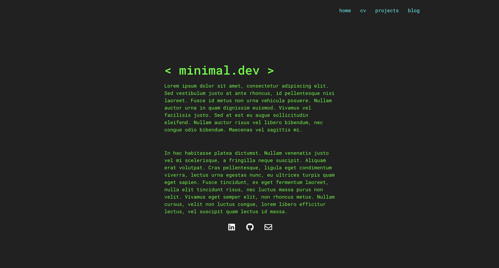
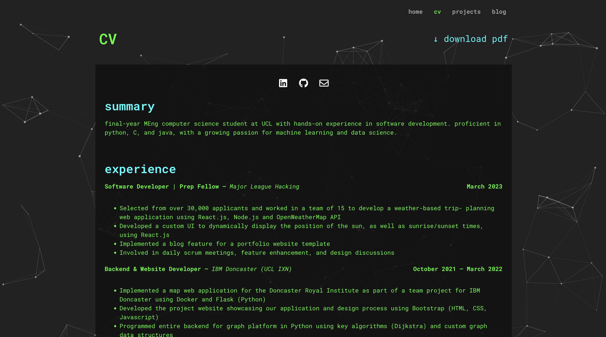

# 💻 minimal-dev

`minimal.dev` is an extremely minimal website theme and template for WordPress I developed from scratch. I developed this theme as a personal project; initially, I just wanted a simple and minimalist theme that was well-suited for a developer's personal website but couldn't find anything to my liking, so I set out to create my own.

I used this template for my own site [here](https://hanafi.dev)!

## Screenshots

## Installation

Head to your WordPress dashboard.

Go to `Plugins > Add New`, and then install the `Elementor Website Builder` (this will be what you use to import the template, but will also enable you to edit the website easily). Activate the plugin.

Now, click on `Appearance > Themes`, then `Add New`, and then install and activate the `Hello Elementor` theme (the base theme upon which this is built).

Finally, go to `Elementor > Tools` and then `Import / Export Kit > Start Import`, and drag the `minimal-dev.zip` file in. Make sure the plugins and components are all checked (they should be by default), and import. That's it!

## Editing

Editing the website is very easy! Just click on `Pages` and, underneath the page you would like to edit, click on `Edit with Elementor`. The drag-and-drop Elementor editor is extremely intuitive to use, but there are many guides and resources for help online.

To add blog posts, go to `Posts > Add New` and then you should once again be able to `Edit with Elementor` to create your blog post. Once published, it will appear on the blog page automatically.

## Issues

There are no known issues with the template at the moment, but feel free to leave issues on the repository should you find any and I will get to them as soon as I can!

## FAQ

*I can't see the navbar, how do I fix that?*

Sometimes the header needs to be manually enabled after the files are imported. Go to `Appearance > Menus` and, under Display Location in Menu Settings, tick the `Header` option. Press `Save Menu` and you should be able to see the navbar.